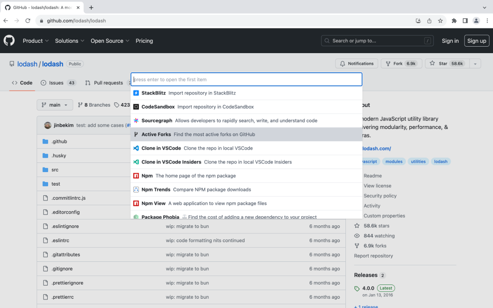
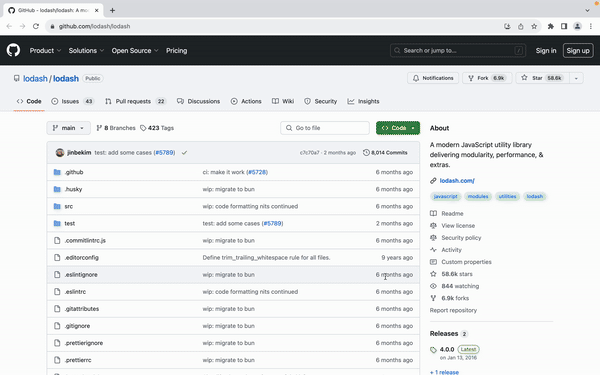

# Open Related Website

A Chrome extension to quickly open websites related to the current page.

## 🔧 Install

[link-chrome]: https://chromewebstore.google.com/detail/open-related-website/kgpcgldebjnldkgfiecjogencpiadpml 'Version published on Chrome Web Store'

[][link-chrome] [][link-chrome] and other Chromium browsers

## 🔍 Usage

Just use the shortcut `Alt + O` to open the search box, click the website you want to open.

You can custom the shortcut on <chrome://extensions/shortcuts>

## 📝 TODOs

- [ ] custom rules

## ❤️ Thanks

- [WXT](https://github.com/wxt-dev/wxt) web extension development framework
- [GitHub-Web-IDE](https://github.com/zvizvi/GitHub-Web-IDE) provide idea to open web ide of a github repository
- [flaticon](https://www.flaticon.com/free-icon/neural_2103633?term=network&page=1&position=8&origin=search&related_id=2103633) provide this extension icon
- [favicon-detector](https://github.com/BlackGlory/favicon-detector) make it easy to get website icon
